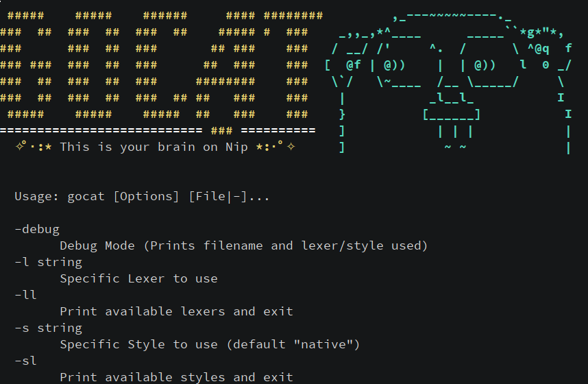
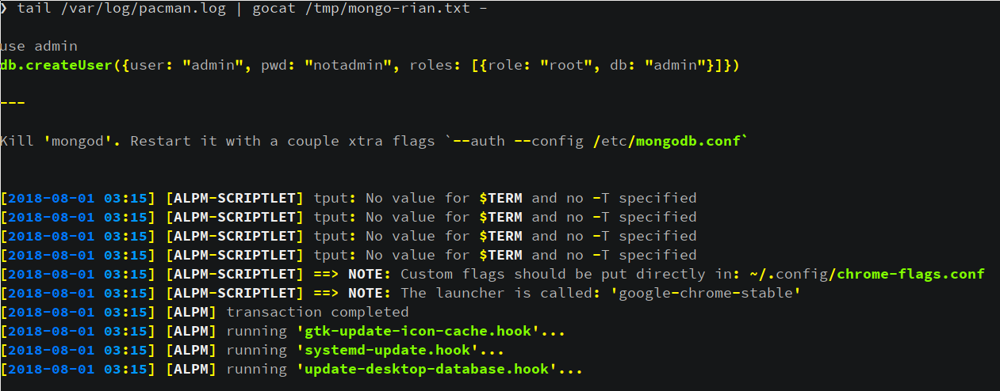

# GoCat



GoCat just sits around with his homies from the [Chroma](https://github.com/alecthomas/chroma) package getting schwifty on Nip, and then endlessly raving about how it's made his life soo much more colorful... 

I guess another way to think about it would be to say it's just a colorized version of cat, that uses the Chroma package for highlighting.

Attempts have been made to override fallback style/lexer with the intent that everyfile gocat'd should have at least something highlighted in it. Whether the highlighting is in anyway useful is, just like your opinion man. On that note, other attempts were made to try and normalize/tweak how the styles are rendered in the terminal.

---

## Install

```shell
$> go get github.com/traviscampbell/gocat
```

## Usage

Should function like the `cat` command, provide file(s) as argument or use '-' to signify shit is on stdin.

